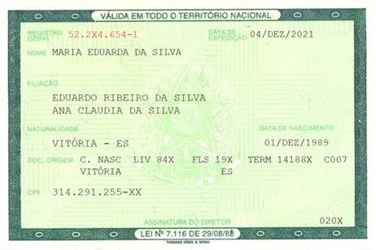
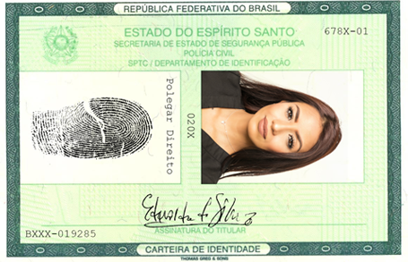

Lidar com imagens em R é algo que tem um quê de dificuldade, até por conta da escassez de material que se propõe a lhe ensinar como fazer o tratamento. Já vinha alimentando essa curiosidade minha há tempos, queria entender como fazer a extração de dados que originalmente estão encravados em uma imagem. 

Quando surgiu uma polêmica no Twitter - devido à uma horda de adolescentes terem tido a genial ideia de postar foto de seus documentos online -, foi me dado o incentivo para gastar o tempo - em que eu deveria estar trabalhando - em mais um post para este lindo blog.

Primeiro vale falar que não é uma tarefa simples, faltam ferramentas para executarem determinadas tarefas, em especial na fase de pré-processamento de imagem. Também ressalto que esse não tem como objetivo ser um tutorial definitivo sobre tratamento de imagem em R, é só uma brincadeira que pode lhe introduzir ao assunto. Por fim, **pontuo que alguns trechos de código aqui presentes (com especial atenção às expressões regulares) estão intencionalmente confusos**, decidi por fazer isso justamente para dificultar o uso do código aqui presente para fins escusos.

---

Começo então carregando as bibliotecas necessárias:

```{r message=FALSE, warning=FALSE}
library('tesseract') # Transforma imagens em texto.
library('magick') # Tratamento de imagens
library('stringr') # Tratamento de texto
library('tidyverse') # Metabiblioteca
library('image.libfacedetection') # Detecta faces
library('stringi') # Tratamento de textos
library('purrr') # Programação Funcional
```

Agora eu começarei efetivamente a extrair o texto das imagens, primeiro eu irei observar a imagem que há de ser analisada:



Temos aqui o verso de um documento de identidade comum, dependendo de quão no futuro você esteja, talvez não conheça esse padrão do documento. Esse é o padrão de identidade antigo, e neste ano de 2020, a maior parte das identidades estão nesse padrão.

*Vale notar que essa identidade é fictícia, e os numeros são todos falsos. A 'Maria Eduarda' não existe.*


```{r}
remove_acct_char <- function(str){
  #' Essa função remove os acentos das palavras.
      
    stringi::stri_trans_general(str, id= "Latin-ASCII")
}


  id <- tesseract::ocr('../../img/id_verso.png', 
                     engine = tesseract('por')) %>% 
  str_replace_all(pattern = '\n', 
                  replacement = ' ') %>% {
  list(
  rg = stringr::str_extract(., pattern = '\\d{2}\\..{3}\\..{3}\\-\\d'), #extrai o RG
  
  nome = stringr::str_extract_all(., pattern = '((Nove|Nome)(\\s\\w{1,20}\\s\\w{1,20}\\s(\\w{1,20})?\\s(\\w{1,})?))'), #extrai
  
  datas = stringr::str_extract_all(., pattern = '\\d{2}/(\\w{3}|\\d{2})/(\\d{4})'), #extrai data de nascimento e expedição
  
  cpf = stringr::str_extract(., pattern = '(\\d{3}\\.){2}\\d{3}\\-.{2}'), #extrai o CPF
  
  doc_origem = remove_acct_char(stringr::str_extract(., pattern = '(C(\\.\\s)NASC).{1,50}\\w{2}')) #Dados da certidão de nascimento.
  )
  } %>% 
    unlist %>% 
    enframe


```

Começo criando uma função que futuramente será útil, a função `remove_acct_char`. Essa função que criamos usa da mudança de `encoding`, por meio da função `stringi::stri_trans_general()`, para fazer a remoção de acentuação das palavras. Um exemplo pode ser visto abaixo: casarão => casarao.

```{r}
remove_acct_char('Eu vivo em um casarão')
```

- Logo depois eu crio um objeto chamado id, é nele em que armazenarei o resultado da extração das informações da identidade da nossa querida Maria Eduarda. 

Começarei usando a biblioteca `tesseract`, que faz a leitura de imagem e extrai o texto ali presente. Para que a Tesseract funcione é recomendado que os dados estejam alinhados, isto é, o texto precisa estar em linhas, texto na diagonal (ou de cabeça para baixo) pode gerar problemas, provavelmente irá. Uso o argumento `engine='por'`, que indica ao Tesseract que a linguagem do documento é português, assim o processamento é otimizado para nosso idioma. O Tesseract irá retornar o texto abaixo:

```{r echo=FALSE}
tesseract::ocr('../../img/id_verso.png', 
                     engine = tesseract('por'))
```


Logo após isso, eu irei passar a string por uma expressão regular com o objetivo de substituir o padrão '\n' por um espaço em branco. O padrão indica ao programador que ali temos uma quebra de linha, mas não será util a nós, por isso a remoção.

Então, crio uma `list` que agrupará das strings com o texto que faremos a extração por meio de expressões regulares. Uso expressões regulares para extrair os seguintes dados: `rg`, `cpf`, `datas` (expedição e nascimento), `doc_origem` - este último são os dados acerca da Certidão de Nascimento.

Por fim, retiro as informações da `list`, usando `unlist()`, issso farácom que nossa lista se torne um conjunto de strings. E então uso a função `enframe` para criar uma `data.frame`- na verdade, uma `tibble` - com nossos dados.


```{r tibble, echo=FALSE}
(id)
```

O resultado contudo não é satisfatório, como pode-se ver a nossa tabela não está em formato Tidy, o que dificulda nosso trabalho. Devemos agora tratar a tabela, tornando-a ideal para a manipulação usando o `dplyr` e o `tidyr`. Além disso, a nossa expressão regular também capturou um trecho 'Nove' que está anterior ao nome de Maria Eduarda, precisamos corrigir isso.

```{r}
id %>% 
  pivot_wider() %>%  # 'gira' a tabela, transformando-a em formato longo
  mutate(nome = str_remove(nome, '(Nove|Nome)\\s'), #r
         rg = toupper(rg)) %>% 
  rename(exp = datas1,
         nasc = datas2)


```

Agora aproveitamos da pivot_wider(), função nova do tidyr para rotacionar nossa tabela e transformar ela em um formato ideal. O que anteriormente era a primeira coluna, agora está nos nomes. O que era a segunda coluna, agora está em uma só linha. Finalmente, tidy!

Contudo, o que eu mostrei anteriormente é que existe uma parte da frente da identidade da nossa querida Maria Eduarda. Vamos aproveitar para retirar a foto dela dali? Vai que você quer guardar uma 3x4 da Duda?




Para isso, usarei uma biblioteca experimental, que é a `image.libfacedetection` - que não está no CRAN, mas está aqui(LINK), junto à já bem conhecida biblioteca `magick`.

```{r}
img = magick::image_read('~/Imagens/id_frente.png') %>% 
  image_rotate(270)

rosto = image_detect_faces(img)

plot(rosto, img, border = "red", lwd = 3, col = "white")


```

Primeiro, uso a `magick::image_read()` para fazer a leitura da imagem, carregando-a na memória. Logo rotaciono a imagem para que ela fique de pé, a rotação é importante pois a nossa `image.libfacedetection` não reconhecerá a face caso a imagem esteja deitada.

Passamos então a imagem já rotacionada à função `image_detect_faces()`, ela localizará onde estão as faces. Então uso a função `plot()` para marcar na nossa imagem onde está o rosto.

Feito isso, temos nosso rosto, temos nossos dados.

Abraços!


<!--more-->
